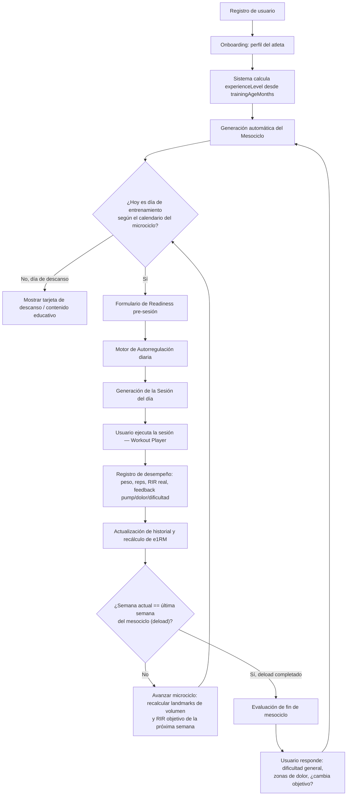
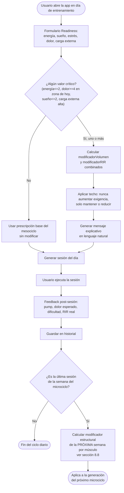
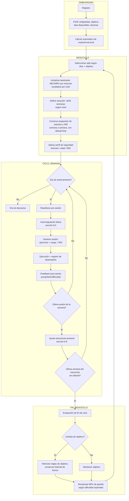

# FitGen — Documento de Diseño de Software (DDS)

**Versión:** 1.0
**Estado:** Aprobado como guía rectora del reinicio de desarrollo
**Fecha:** Julio 2026
**Alcance:** Este documento es la **fuente única de verdad** sobre cómo debe comportarse el motor de entrenamiento de FitGen. Ninguna implementación, endpoint, o función debe contradecir las reglas aquí definidas. Si en algún momento el código y este documento entran en conflicto, **el documento gana** y el código se corrige — o el documento se actualiza mediante una revisión explícita y justificada con evidencia.

---

## 0. Control de cambios

| Versión | Fecha | Cambio |
|---|---|---|
| 1.0 | Jul 2026 | Primera versión. Redefinición completa del producto: nicho acotado a usuarios de gimnasio, objetivos limitados a Hipertrofia y Fuerza, benchmarking contra RP Hypertrophy App. |

---

## 1. Resumen ejecutivo

FitGen es una PWA que genera y adapta automáticamente el entrenamiento de un usuario de gimnasio, semana a semana y sesión a sesión, aplicando los mismos principios que un entrenador experto en ciencias del deporte usaría: landmarks de volumen, autorregulación por RIR/RPE, periodización ondulante dentro de un mesociclo, sobrecarga progresiva basada en el historial real del usuario, y prevención de estancamiento.

**Lo que cambia respecto a la versión anterior del producto:**

1. **Nicho:** de "cualquiera, en cualquier lugar" a **usuarios que entrenan de forma constante en un gimnasio comercial con equipo completo**. Se elimina toda la lógica de entrenamiento en casa, equipo limitado, bodyweight-only y outdoor.
2. **Objetivos soportados en v1:** únicamente **Hipertrofia** y **Fuerza**. El resto (resistencia, pérdida de grasa, salud general, rendimiento deportivo) queda fuera de alcance hasta validar el motor central.
3. **Modelo de negocio:** registro abierto, gratuito para los primeros usuarios (beta). Se elimina toda pasarela de pago (Stripe) del código base. MercadoPago se evaluará más adelante, una vez validado con beta testers — no se implementa en esta fase.
4. **Benchmark de referencia:** RP Hypertrophy App (Renaissance Periodization / Dr. Mike Israetel), tanto en metodología de periodización (landmarks de volumen MEV/MAV/MRV, autorregulación por feedback) como en UX (simplicidad del feedback post-sesión).
5. **Base de datos de ejercicios:** se reestructura para minimizar lecturas en Firestore (3 documentos: calentamiento, enfriamiento, entrenamiento principal) y se depura para contener solo ejercicios viables en un gimnasio comercial.

Este documento cubre **exclusivamente el diseño del sistema** (reglas, algoritmos, flujos de decisión, arquitectura de datos). La ejecución de la limpieza de código y de Firestore ocurre en una fase posterior, ya acordada, que no se ejecuta hasta que este documento esté validado.

---

## 2. Usuario objetivo y alcance del producto

### 2.1 Perfil de usuario (ICP)

> Persona adulta que entrena en un **gimnasio comercial o privado con equipo completo** (barras, discos, mancuernas, máquinas selectorizadas, poleas, rack, bancos), de forma **constante** (mínimo 2, típicamente 3–6 sesiones/semana), cuyo objetivo primario es **ganar músculo (hipertrofia)** y/o **ganar fuerza**, y que quiere dejar de improvisar sus rutinas o depender de programas genéricos de PDF/Excel.

### 2.2 Explícitamente fuera de alcance (v1)

| Excluido | Razón |
|---|---|
| Entrenamiento en casa / equipo limitado / bodyweight-only / outdoor | Diluye la calidad del algoritmo; el equipo real de un gym permite prescripción de carga precisa y progresión fiable |
| Objetivos: Resistencia, Pérdida de grasa, Salud general, Rendimiento deportivo | Cada objetivo requiere reglas fisiológicas propias; mejor validar el motor con 2 objetivos antes de expandir |
| Pasarela de pago | No hay monetización en la fase de beta abierta y gratuita |
| Usuarios sedentarios / principiantes absolutos sin acceso a gimnasio | El produce asume acceso constante a instalación con equipo estándar |

### 2.3 Objetivos soportados en v1

| Objetivo | Enum interno |
|---|---|
| Hipertrofia | `HIPERTROFIA` |
| Fuerza | `FUERZA` |

Ambos comparten el mismo motor de periodización (landmarks de volumen + autorregulación por RIR), pero difieren en **rangos de repeticiones, intensidad relativa, tiempos de descanso y criterio de progresión**, según el detalle de la sección 5.

### 2.4 Niveles de experiencia — decisión de diseño

El usuario pidió que decidiéramos qué esquema de experiencia usar. **Se mantienen 3 niveles**, pero redefinidos por **antigüedad de entrenamiento continuo con sobrecarga progresiva** (no autopercepción), porque la evidencia muestra que el estatus de entrenamiento modera tanto la respuesta al volumen como la respuesta a la periodización (los avanzados se benefician más de la periodización ondulante y necesitan deloads más frecuentes; ver sección 5.5 y 5.7):

| Nivel | Definición operativa | Implicación |
|---|---|---|
| **Novato** | < 6 meses de entrenamiento estructurado y continuo | MEV bajo, progresión rápida, mesociclos largos (6 sem), deload opcional |
| **Intermedio** | 6 meses – 2 años | MEV/MAV medios, mesociclos de 5 semanas, deload obligatorio |
| **Avanzado** | > 2 años de entrenamiento estructurado con progresión documentable | MEV/MAV/MRV altos, mesociclos de 4 semanas, deload obligatorio más frecuente |

Este dato se recoge en el onboarding como **antigüedad de entrenamiento en meses**, no como una etiqueta subjetiva — el sistema calcula el nivel, el usuario no lo autoselecciona. Esto evita el sesgo de autopercepción (muy común: usuarios que se llaman "avanzados" sin serlo) y es coherente con cómo RP Hypertrophy App resuelve el mismo problema (usa años de entrenamiento, no autoevaluación de nivel).

---

## 3. Principios rectores no negociables

Estas reglas son la constitución del sistema. Toda función nueva debe poder trazarse a uno de estos principios.

1. **El volumen semanal por músculo es la variable dominante de hipertrofia.** Ninguna decisión de diseño debe sacrificar volumen por otra variable (frecuencia, orden de ejercicios, tempo) sin una razón explícita y documentada.
2. **La intensidad de esfuerzo (RIR/RPE) —no el %1RM fijo— es el mecanismo primario de autorregulación diaria.** El sistema nunca prescribe "80% de tu 1RM" como número aislado sin contexto de RIR objetivo.
3. **Todo mesociclo progresa de MEV → MRV y termina en deload.** No existen mesociclos sin fase de descarga planificada.
4. **La progresión de carga se basa en el historial real del usuario (e1RM calculado), nunca en un porcentaje genérico de tablas poblacionales.**
5. **El feedback del usuario (pre-sesión y post-sesión) siempre puede sobreescribir la prescripción automática.** El algoritmo sugiere; el usuario decide. Nunca se bloquea el entrenamiento por falta de "aprobación" del sistema.
6. **El sistema debe poder explicar cada decisión en lenguaje natural** ("bajamos tu volumen esta semana porque tu feedback de dolor muscular fue alto 3 sesiones seguidas"). Ninguna decisión algorítmica es una caja negra para el usuario.
7. **Todo el catálogo de ejercicios usado debe ser ejecutable en un gimnasio comercial estándar.** No se seleccionan ejercicios que dependan de equipo no garantizado.
8. **Seguridad antes que progresión.** Ante señales de dolor articular, DOMS severo o fatiga extrema, el sistema reduce automáticamente la exigencia, nunca la aumenta "para no perder el ritmo".
9. **Cada regla numérica de este documento debe estar anclada a evidencia citada** (sección 5 y 14). Si se cambia un número, se debe poder justificar con una fuente.

---

## 4. Benchmark: RP Hypertrophy App

### 4.1 Qué hace bien RP (imitar)

| Elemento RP | Por qué funciona |
|---|---|
| **Landmarks de volumen por músculo (MEV/MAV/MRV)** individualizados y progresivos | Traduce literatura compleja de dosis-respuesta en una heurística simple y accionable |
| **Progresión aditiva de sets** ("+1 set por músculo por semana") en vez de saltos agresivos | Estímulo predecible, fatiga controlable, fácil de entender para el usuario |
| **Feedback post-sesión ultra simple**: pump, dolor muscular, dificultad percibida | 3 preguntas, cierran el loop de autorregulación sin fricción |
| **RIR objetivo que sube automáticamente** a medida que avanza el mesociclo (de RIR alto a RIR bajo antes del deload) | Coincide con la realidad fisiológica: a más fatiga acumulada, menos reps en reserva reales aun con el mismo esfuerzo prescrito |
| **El usuario siempre puede sobreescribir** manualmente sets/pesos | Respeta la autonomía y evita frustración cuando el algoritmo se equivoca |
| **Deload obligatorio al final de cada mesociclo** | Gestión de fatiga no negociable, no depende de que el usuario "se acuerde" |

### 4.2 Dónde vamos a mejorar sobre RP

| Limitación de RP | Mejora de FitGen |
|---|---|
| Requiere que el usuario **configure manualmente** el mesociclo inicial (ejercicios, split, duración) | FitGen **genera automáticamente** el mesociclo completo a partir del perfil (días disponibles, nivel, objetivo) — cero fricción de configuración |
| Autorregulación **solo post-sesión/semanal** (pump, soreness, dificultad) — no reacciona a cómo llega el usuario *ese día* | FitGen añade una capa de **autorregulación pre-sesión** (energía, sueño, estrés, fatiga externa) que ajusta la sesión de *hoy*, además del ajuste estructural semanal estilo RP |
| No integra objetivo de **Fuerza** con la misma profundidad que Hipertrofia (es una app separada, RP Strength) | FitGen unifica Hipertrofia y Fuerza en un solo motor con reglas específicas por objetivo, sin fragmentar el producto |
| Interfaz en inglés, pensada para mercado US | FitGen es español-first, pensado para el mercado hispanohablante |
| No tiene contexto de "qué tan lleno está el gimnasio" ni ajusta por logística real del día | (Roadmap post-v1, ya existía como idea en el producto original — se preserva como mejora futura) |
| Modelo de suscripción de pago desde el día uno | FitGen abre con beta gratuita para validar el algoritmo antes de monetizar |

**Conclusión de benchmarking:** replicamos la solidez metodológica de RP (landmarks + autorregulación + deload obligatorio) pero eliminamos su fricción de configuración manual y añadimos una capa de autorregulación diaria que RP no tiene.

---

## 5. Fundamentos científicos (evidencia que sustenta cada regla)

### 5.1 Volumen de entrenamiento y relación dosis-respuesta

- La relación entre sets semanales y ganancia de masa muscular es **positiva y con rendimientos decrecientes**, sin techo claro identificado hasta la fecha (Pelland et al., meta-regresión 2024/2025, *Medicine & Science in Sports & Exercise*; 35 estudios, 220 efectos, 1032 participantes). El mejor modelo (raíz cuadrada) estimó **+0.24% de hipertrofia por set adicional** en el rango medio de volumen.
- El método de conteo **"fraccional"** (series indirectas cuentan 0.5, directas cuentan 1.0) es el que mejor predice el resultado — se adopta este método para calcular volumen por músculo en FitGen.
- Schoenfeld et al. (2017) reportan tendencia a mayor hipertrofia con ≥9-10 series semanales por grupo muscular vs. menos; revisiones sombrilla (Roberts et al., 2022) confirman **≥10 sets/semana** como umbral práctico razonable para adultos entrenados.
- **Regla de diseño:** el volumen semanal por músculo (sets directos+indirectos fraccionados) es la palanca principal de programación; todo lo demás (frecuencia, orden, tempo) es secundario y se ajusta *alrededor* del volumen, no en su lugar.

### 5.2 Landmarks de volumen (MV / MEV / MAV / MRV)

Adoptamos la terminología y valores de referencia popularizados por Israetel/RP y consistentes con la literatura de Schoenfeld:

- **MV (Maintenance Volume):** volumen mínimo para *no perder* masa muscular ya ganada.
- **MEV (Minimum Effective Volume):** volumen mínimo que **sí** produce crecimiento. Punto de partida de cada mesociclo.
- **MAV (Maximum Adaptive Volume):** rango donde la relación estímulo/fatiga es óptima. Es una **zona**, no un número fijo — crece a medida que el mesociclo avanza y el usuario se "calienta" al bloque.
- **MRV (Maximum Recoverable Volume):** techo antes de que la fatiga supere la capacidad de recuperación. Al llegar aquí, se activa el deload.

**Tabla de referencia inicial (sets directos equivalentes por semana, ajustados por autorregulación individual):**

| Grupo muscular | MV | MEV | MAV (rango) | MRV |
|---|---|---|---|---|
| Pecho | 4 | 8 | 12–18 | 22 |
| Espalda (dorsal/ancho) | 6 | 10 | 14–22 | 25 |
| Hombro (deltoide, énfasis lateral/posterior) | 4 | 8 | 12–20 | 26 |
| Bíceps | 4 | 8 | 10–16 | 20 |
| Tríceps | 4 | 6 | 10–14 | 18 |
| Cuádriceps | 4 | 8 | 12–18 | 20 |
| Isquiotibiales | 3 | 6 | 8–12 | 16 |
| Glúteos | 3 | 6 | 10–16 | 20 |
| Pantorrillas | 4 | 6 | 12–16 | 20 |
| Core / Abdomen | 0 | 4 | 8–12 | 16 |

Estos valores son **puntos de partida poblacionales**, no verdades fijas: la sección 8 define cómo el sistema los personaliza por autorregulación semana a semana según el feedback real del usuario (igual que hace RP).

**Ajuste por nivel de experiencia:** los novatos operan en el extremo inferior de cada rango (MEV más bajo, MAV más angosto) y progresan más rápido en carga relativa; los avanzados operan más cerca del MRV de forma sostenida y su margen de progresión de carga es más lento.

### 5.3 Intensidad de esfuerzo — RIR/RPE como mecanismo de autorregulación

- Escalas de RIR (repeticiones en reserva) y RPE son **válidas, sensibles al nivel de fuerza del atleta y factibles** de implementar sin equipo adicional (revisión de alcance, *Sportverletzung/Sportschaden* 2024; scoping review 2024 en *Strength & Conditioning*).
- Meta-análisis en red 2025 (*Journal of Exercise Science & Fitness*) sobre métodos de autorregulación para fuerza máxima: **APRE (autoregulación progresiva) > VBT (velocidad) > RPE > entrenamiento basado en %1RM fijo** en efectividad. Los tres métodos autorregulados superan al porcentaje fijo.
- Comparaciones directas muestran que **RIR y VBT mantienen mejor el volumen de entrenamiento** que %1RM y RPE puro, porque no fuerzan al fallo de forma sistemática cuando el rendimiento del día es distinto al esperado.
- **Regla de diseño:** FitGen prescribe siempre un **RIR objetivo por serie**, nunca un porcentaje de 1RM aislado. El %1RM se calcula *hacia atrás* desde el RIR objetivo y el historial de cargas, usando la tabla de Zourdos/Helms (sección 8.7), pero el contrato con el usuario siempre es "deja X repeticiones en reserva", no "levanta el 82%".

### 5.4 Frecuencia de entrenamiento por grupo muscular

- Cuando el volumen semanal se **iguala**, la frecuencia (2 vs. 3+ sesiones/semana por músculo) **no genera diferencias significativas en hipertrofia** (múltiples RCT: Yue et al. 2022 PMC6724585; Barroso et al.; meta-regresión Pelland 2024/2025: probabilidad posterior de efecto de frecuencia sobre hipertrofia <100%, compatible con efecto nulo).
- Para **fuerza**, la frecuencia sí tiene un efecto positivo con rendimientos decrecientes (Pelland et al., probabilidad posterior 100% de pendiente > 0 para fuerza).
- **Regla de diseño:** la frecuencia se elige por **practicidad de distribución del volumen y de la técnica**, no porque "más frecuencia = más crecimiento". Para objetivo Fuerza, se favorece 2× por semana como mínimo en los levantamientos principales para capitalizar el efecto de frecuencia sobre la fuerza y la práctica motriz.

### 5.5 Periodización — modelo elegido

- Cuando el volumen está igualado, **no hay diferencia significativa en hipertrofia** entre periodización lineal, ondulante o ausencia de periodización (Grgic et al. 2017, meta-análisis DUP vs. LP: d=-0.02, IC95% [-0.25, 0.21]; Williams et al. 2017: hipertrofia sin diferencia entre NP y periodizado, ES=0.13, p=0.27).
- Para **fuerza (1RM)**, la periodización **sí supera** al entrenamiento no periodizado (Williams et al. 2017, ES=0.31, p=0.02), y la **periodización ondulante supera a la lineal en sujetos entrenados** (ES=0.61, p=0.05), aunque no en sujetos no entrenados.
- **Regla de diseño:** se adopta un modelo de **periodización ondulante dentro del mesociclo** (el RIR objetivo ondula semana a semana mientras el volumen tiende a subir de MEV a MRV), porque: (a) no perjudica la hipertrofia, (b) maximiza la ganancia de fuerza en usuarios intermedios/avanzados, y (c) es el modelo que usa RP, nuestro benchmark de referencia validado en la práctica.

### 5.6 Selección y orden de ejercicios

- El orden de ejercicios (multiarticular→aislamiento vs. viceversa) **no afecta la magnitud de hipertrofia** (meta-análisis 2020, *European Journal of Sport Science*: ES=0.03, p=0.86, 11 estudios, I²=0%).
- El orden **sí afecta la fuerza**: se gana más fuerza en el ejercicio que se realiza *primero* en la sesión (ES=0.32 a favor de multiarticular primero cuando se mide fuerza multiarticular; ES=-0.58 a favor de aislamiento primero cuando se mide fuerza en aislamiento) — el patrón es de **especificidad por orden**, no una superioridad universal del multiarticular.
- **Regla de diseño:**
  - Para objetivo **Fuerza**: el/los levantamiento(s) principal(es) del día (el que define el objetivo de fuerza) siempre va **primero**, en estado de frescura máxima.
  - Para objetivo **Hipertrofia**: se mantiene el orden multiarticular → accesorio → aislamiento por razones **prácticas** (eficiencia de carga/descarga de peso, gestión de fatiga técnica, seguridad con cargas más pesadas en fresco) — no por una ventaja de hipertrofia demostrada, que no existe. Esta distinción debe quedar documentada en el código para que nadie la "optimice" mal en el futuro.

### 5.7 Deload y gestión de fatiga

- El deload es una reducción **planificada y temporal** del estrés de entrenamiento (volumen y/o intensidad) para mitigar fatiga acumulada sin perder adaptaciones (consenso Delphi internacional, *Sports Medicine Open* 2023; revisión práctica 2024, *Strength & Conditioning Journal*).
- Duración típica: **5–7 días**. Reducción típica de volumen: **25–60%**. La intensidad de carga puede mantenerse o reducirse levemente; **reducir volumen es más consensuado que reducir intensidad**.
- Frecuencia recomendada por nivel: **novatos rara vez lo necesitan de forma programada** (su carga absoluta genera poca fatiga relativa); **intermedios cada 5–8 semanas**; **avanzados cada 3–5 semanas** (mayor fatiga absoluta y proximidad a su techo genético).
- Estudios recientes (Coleman et al. 2024, *PeerJ*) muestran que una semana de descarga bien ejecutada **no compromete** las ganancias de fuerza ni hipertrofia a mediano plazo.
- **Regla de diseño:** deload = **reducción de volumen ~50%, mantenimiento o reducción leve de intensidad (RIR +2 a +3 respecto a la última semana)**, duración de 1 semana, **obligatorio** al final de cada mesociclo para Intermedio/Avanzado; para Novato es una semana de técnica/recuperación ligera pero no estrictamente un deload de alta fatiga.

### 5.8 Sobrecarga progresiva y estimación de 1RM

- La sobrecarga progresiva (aumento gradual de la demanda de entrenamiento: peso, reps, sets, o proximidad a fallo) sigue siendo el mecanismo causal aceptado detrás de las adaptaciones de fuerza e hipertrofia a largo plazo.
- Fórmula de estimación de 1RM: **Brzycki** — `1RM = peso / (1.0278 - 0.0278 × reps)`. Válida hasta ~10 reps con buena precisión; por encima de 10 reps la estimación pierde precisión y se pondera con menor peso en las decisiones de carga.
- **Regla de diseño (límites de seguridad, ya validados en la implementación previa y conservados por ser prudentes):**
  - Incremento máximo de carga semana a semana: **+5% en ejercicios multiarticulares, +3% en aislamiento** (los multiarticulares reclutan más masa muscular y toleran incrementos relativos mayores sin comprometer la técnica).
  - Incremento máximo sesión a sesión dentro de la misma semana: **+2.5% multiarticular, +2% aislamiento**.
  - Cuando el incremento de peso disponible en el gimnasio (saltos de disco/mancuerna) excede el incremento permitido, el sistema **prescribe una repetición adicional en vez de más peso** (mismo enfoque que usa RP).

### 5.9 Patrones de movimiento y clasificación biomecánica

Se conserva la taxonomía funcional ya usada en el catálogo actual (coherente con la clasificación de McGill y Boyle), por ser estándar y estar ya reflejada en los datos:

`Empuje_Horizontal`, `Empuje_Vertical`, `Traccion_Horizontal`, `Traccion_Vertical`, `Dominante_Rodilla`, `Dominante_Cadera`, `Core`, `General`.

Esta taxonomía es la que permite, dado un foco de sesión (ej. "Torso — Empuje"), resolver automáticamente qué patrones de movimiento debe cubrir la sesión, independientemente del nombre exacto del ejercicio.

---

## 6. Arquitectura de datos

### 6.1 Perfil del atleta (`users/{userId}.profileData`)

```json
{
  "name": "string",
  "age": "number",
  "gender": "M | F",
  "heightCm": "number",
  "currentWeightKg": "number",
  "trainingAgeMonths": "number",          // reemplaza la autopercepción de nivel
  "experienceLevel": "Novato | Intermedio | Avanzado", // CALCULADO por el sistema, no editable directamente
  "fitnessGoal": "Hipertrofia | Fuerza",
  "trainingDaysPerWeek": "number (2-6)",
  "weeklyScheduleContext": [
    { "day": "Lunes", "canTrain": true, "externalLoad": "ninguna|ligera|moderada|alta" }
  ],
  "injuriesOrLimitations": ["string"],     // ej. "Hombro", "Rodilla", "Espalda_Baja", "Muñeca"
  "timezone": "string"
}
```

Notas de diseño:
- `preferredTrainingLocation`, `availableEquipment`, `homeEquipment`, `hasHomeEquipment` **se eliminan del modelo**: el equipo se asume gimnasio comercial completo por defecto, sin excepción, en v1.
- `injuriesOrLimitations` se **activa** en el onboarding (existía en tipos pero no se recogía en la UI anterior) porque es una entrada crítica de seguridad (principio rector #8).

### 6.2 Mesociclo (`users/{userId}.currentMesocycle`)

```json
{
  "mesocycleId": "string",
  "goal": "Hipertrofia | Fuerza",
  "experienceLevel": "Novato | Intermedio | Avanzado",
  "durationWeeks": "4 | 5 | 6",           // según nivel, ver 2.4
  "splitType": "Full_Body | Torso_Pierna | Push_Pull_Legs | Hibrido_PHUL",
  "startDate": "ISO date",
  "endDate": "ISO date",
  "currentWeek": "number",
  "status": "activo | evaluacion_pendiente | completado",
  "volumeLandmarks": {
    "Pecho": { "MEV": 8, "MAV_actual": 8, "MRV": 22 },
    "...": "... una entrada por grupo muscular relevante al split"
  },
  "microcycles": [
    {
      "week": 1,
      "phase": "acumulacion | intensificacion | deload",
      "rirObjetivo": 4,
      "volumeMultiplier": 1.0,
      "sessions": [
        { "dayOfWeek": "Lunes", "sessionFocus": "Torso (Empuje)", "isRestDay": false }
      ]
    }
  ]
}
```

### 6.3 Sesión generada (`users/{userId}.currentSession`)

```json
{
  "sessionId": "string",
  "mesocycleId": "string",
  "weekNumber": "number",
  "dayOfWeek": "string",
  "sessionFocus": "string",
  "generatedAt": "ISO datetime",
  "readinessAdjustment": {
    "energyLevel": 1,
    "sorenessLevel": 1,
    "volumeMultiplierApplied": 1.0,
    "rirDeltaApplied": 0,
    "userMessage": "string explicando el ajuste en lenguaje natural"
  },
  "warmup": [ "...ejercicios RAMP..." ],
  "mainBlock": [
    {
      "exerciseId": "string",
      "muscleGroup": "string",
      "movementPattern": "string",
      "sets": 4,
      "repRange": "8-12",
      "rirTarget": 3,
      "prescribedLoadKg": 62.5,
      "restSeconds": 120,
      "tempo": "3-1-2-1",
      "isPriorityLift": false
    }
  ],
  "cooldown": [ "...ejercicios de enfriamiento..." ],
  "completed": false
}
```

### 6.4 Historial de desempeño (`users/{userId}.recentSessions`, FIFO)

Cada sesión completada se archiva con: sets/reps/peso real ejecutado, RIR reportado por el usuario, feedback post-sesión (pump, dolor muscular, dificultad percibida — estilo RP), y duración real. Este historial es la **única fuente** para calcular e1RM y decidir progresión — nunca se usan tablas poblacionales para progresión individual (principio rector #4).

### 6.5 Catálogo de ejercicios — nueva estructura en Firestore

Para minimizar lecturas (pedido explícito), el catálogo se reorganiza de "un documento gigante" a **3 documentos fijos** dentro de la colección `catalogs`:

| Documento Firestore | Contenido | Lecturas por generación de sesión |
|---|---|---|
| `catalogs/calentamiento` | Ejercicios `categoriaBloque: calentamiento` (fases RAMP) | 1 lectura |
| `catalogs/enfriamiento` | Ejercicios `categoriaBloque: enfriamiento` | 1 lectura |
| `catalogs/entrenamiento` | Ejercicios `categoriaBloque: main_block` + `core` (unificados, ya que ambos se usan en el mismo bloque de la sesión) | 1 lectura |

**Total: 3 lecturas de documento por generación de sesión**, independientemente de cuántos ejercicios existan dentro de cada uno (cada documento contiene un array `items`). Esto sustituye el esquema anterior de 3 rutas de catálogo inconsistentes (`exercises`, `catalogs/exercises`, `unified_exercises/all`) por una única fuente de verdad con exactamente 3 documentos, consumida igual por generación de sesión y por el endpoint de intercambio de ejercicio (`swap-exercise`).

**Criterios de depuración del catálogo (a ejecutar en la fase de limpieza, no en este documento):**
1. Eliminar cualquier ejercicio cuyo `equipo` no sea alcanzable en un gimnasio comercial estándar (ej. equipo de casa muy específico, si existiera).
2. Conservar **todo** el calentamiento y enfriamiento que tenga sentido independientemente del lugar (movilidad, activación, estiramiento) — no depende del gimnasio, depende de la fisiología.
3. Unificar el campo `equipo` a formato array en el 100% de los ejercicios (hoy 7 de 736 están como string suelto).
4. Cada ejercicio debe tener `patronMovimiento`, `parteCuerpo`, `prioridad` y `categoriaBloque` no nulos — si falta alguno, se corrige o se elimina.

---

## 7. Flujo general del sistema



---

## 8. Algoritmo maestro (paso a paso)

Esta sección es el "cómo" exacto. Cada subsección corresponde a un motor independiente y testeable de forma aislada (ver sección 11, arquitectura de módulos).

### 8.1 Onboarding y cálculo de nivel de experiencia

```
ENTRADA: trainingAgeMonths (número, meses de entrenamiento estructurado continuo)

SI trainingAgeMonths < 6:
    experienceLevel = "Novato"
SINO SI trainingAgeMonths <= 24:
    experienceLevel = "Intermedio"
SINO:
    experienceLevel = "Avanzado"

// Determina duración de mesociclo según sección 2.4 / 5.7
mesocycleDuration = { Novato: 6, Intermedio: 5, Avanzado: 4 }[experienceLevel]
```

Validaciones de seguridad en onboarding (principio rector #8):
- Si `injuriesOrLimitations` contiene una zona reconocida (Hombro, Rodilla, Espalda_Baja, Muñeca), se activa un **perfil de seguridad** que se propaga a la generación de mesociclo y sesión (sección 8.5, filtro de exclusión de patrones de movimiento).
- Si edad ≥ 50 o IMC ≥ 30 (calculado de heightCm/currentWeightKg), se activa **protocolo conservador**: evitar sobrecarga axial alta en semana 1, preferir variantes en máquina para el primer mesociclo.

### 8.2 Generación del mesociclo (motor macro)

```
ENTRADA: profileData completo

PASO 1 — Seleccionar split según días disponibles y objetivo:
    SI trainingDaysPerWeek <= 2:        split = Full_Body
    SI trainingDaysPerWeek == 3:        split = Full_Body (Novato) 
                                         u Torso_Pierna_ondulado (Intermedio/Avanzado)
    SI trainingDaysPerWeek == 4:        split = Torso_Pierna
    SI trainingDaysPerWeek == 5:        split = Hibrido_PHUL
    SI trainingDaysPerWeek >= 6:        split = Push_Pull_Legs (frecuencia 2)

PASO 2 — Inicializar landmarks de volumen por músculo (tabla 5.2),
          escalados por experienceLevel:
    PARA CADA músculo relevante al split:
        MEV_usuario = MEV_tabla * factorNivel[experienceLevel]
        MRV_usuario = MRV_tabla * factorNivel[experienceLevel]
        // factorNivel: Novato 0.8, Intermedio 1.0, Avanzado 1.15

PASO 3 — Definir número de semanas de acumulación + 1 semana de deload:
    durationWeeks = { Novato: 6, Intermedio: 5, Avanzado: 4 }[experienceLevel]
    accumulationWeeks = durationWeeks - 1

PASO 4 — Construir la progresión semana a semana (ver 8.3 para el detalle
          de sets y RIR):
    PARA semana EN 1..accumulationWeeks:
        volumen_semana[musculo] = interpolar_lineal(MEV_usuario, MRV_usuario, 
                                                       semana, accumulationWeeks)
        rir_semana = interpolar_descendente(rirInicial[goal], rirFinal[goal], 
                                              semana, accumulationWeeks)
    semana_deload:
        volumen = volumen_semana[accumulationWeeks] * 0.5
        rir = rir_semana[accumulationWeeks] + 2.5

PASO 5 — Asignar sesiones del split a los días disponibles del usuario
          (weeklyScheduleContext), evitando entrenar el mismo patrón de
          movimiento dominante en días consecutivos cuando sea posible.

PASO 6 — Aplicar perfil de seguridad si corresponde (8.1): eliminar o
          sustituir sesiones/ejercicios que contradigan las restricciones
          de lesión reportadas.

SALIDA: objeto Mesociclo completo (ver 6.2), persistido en Firestore.
```

**Valores iniciales de RIR objetivo por objetivo (periodización ondulante dentro del mesociclo, sección 5.5 y 5.7):**

| Objetivo | RIR semana 1 (primera de acumulación) | RIR última semana de acumulación | RIR semana de deload |
|---|---|---|---|
| Hipertrofia | 4 | 0–1 | +2.5 respecto a la última semana |
| Fuerza (levantamientos principales) | 3 | 0–1 | +2.5 respecto a la última semana |
| Fuerza (accesorios de soporte) | 4 | 1–2 | +2.5 respecto a la última semana |

### 8.3 Distribución de volumen semanal (motor micro)

Esta es la traducción práctica del principio "MEV → MRV progresivo estilo RP":

```
PARA CADA semana de acumulación (después de la semana 1):
    PARA CADA grupo muscular:
        // Progresión aditiva, no multiplicativa (sección 4.1, tabla RP)
        setsEstaSemanaBase = setsSemanaAnterior + incrementoSets(musculo)
        
        incrementoSets = ROUND((MRV_usuario - MEV_usuario) / (accumulationWeeks - 1))
        // ej: MEV=8, MRV=20, 4 semanas de acumulación → +4 sets/semana aprox.

        SI setsEstaSemanaBase > MRV_usuario:
            setsEstaSemanaBase = MRV_usuario   // nunca excede el techo

    // Ajuste por autorregulación semanal estilo RP (ver 8.8):
    setsEstaSemanaFinal = setsEstaSemanaBase * modificadorFeedbackSemanaAnterior(musculo)
```

El `modificadorFeedbackSemanaAnterior` es exactamente el mecanismo estilo RP: se calcula a partir del feedback post-sesión de la semana recién completada (sección 8.8) y puede subir, mantener o bajar el volumen planeado antes de aplicar el incremento base.

### 8.4 Generación de la sesión diaria (motor de contenido)

```
ENTRADA: sessionFocus del día (del microciclo), volumen objetivo por músculo
         de la semana, RIR objetivo de la semana, perfil de seguridad,
         historial reciente (recentSessions)

PASO 1 — Determinar patrones de movimiento requeridos según sessionFocus
          (tabla MOVEMENT_PATTERN_MAP, sección 5.9).

PASO 2 — Para cada patrón requerido, seleccionar ejercicios candidatos del
          catálogo `catalogs/entrenamiento`, filtrando por:
            a) patrón de movimiento coincide
            b) no está en la lista de exclusión del perfil de seguridad
            c) prioridad 1 (multiarticular) se resuelve antes que 2/3

PASO 3 — Modo de continuidad (semana 2+ del mismo mesociclo):
          Reutilizar la MISMA selección de ejercicios de la semana 1 para
          permitir comparabilidad de progresión de carga (principio #4).
          Solo se cambia el ejercicio si:
            - el usuario lo solicitó explícitamente (swap), o
            - se detectó meseta (8.9), o
            - cambia el objetivo del mesociclo (nuevo ciclo)

PASO 4 — Ordenar los ejercicios seleccionados dentro del bloque principal:
          SI goal == "Fuerza": levantamiento principal del día PRIMERO,
             después accesorios de soporte.
          SI goal == "Hipertrofia": multiarticular → accesorio → aislamiento
             (razón práctica, no de hipertrofia superior — sección 5.6).

PASO 5 — Asignar sets/reps/RIR por ejercicio según objetivo (tabla 8.2) y
          calcular carga prescrita (8.7).

PASO 6 — Construir calentamiento (RAMP) desde `catalogs/calentamiento`
          relevante a los patrones de movimiento de la sesión, y
          enfriamiento desde `catalogs/enfriamiento`.

SALIDA: objeto Sesión completo (ver 6.3).
```

### 8.5 Autorregulación pre-sesión (readiness del día)

Este es el diferencial de FitGen sobre RP (sección 4.2). Se ejecuta **antes** de generar la sesión, con datos que solo existen el día de hoy:

```
ENTRADA: energyLevel (1-5), sorenessLevel (1-5) + zona, sleepQuality (1-5),
         stressLevel (1-5), externalLoad del día (del weeklyScheduleContext)

modificadorVolumen = 1.0
modificadorRIR = 0
avisos = []

SI energyLevel <= 2:
    modificadorVolumen *= 0.6
    modificadorRIR += 2       // más RIR = menos esfuerzo real permitido
    avisos.push("Energía baja: reducimos volumen para proteger tu sistema nervioso")

SI sorenessLevel >= 4 Y zona coincide con músculos de la sesión de hoy:
    modificadorVolumen *= 0.7
    modificadorRIR += 2
    avisos.push("Dolor muscular alto en la zona de hoy: bajamos intensidad mecánica")

SI sleepQuality <= 2:
    modificadorRIR += 1
    avisos.push("Sueño insuficiente: pedimos menos proximidad al fallo hoy")

SI externalLoad == "alta":
    modificadorVolumen *= 0.85
    avisos.push("Carga externa alta hoy (trabajo/deporte): sesión ligeramente reducida")

// Los moduladores nunca AUMENTAN la exigencia — solo pueden mantenerla o
// reducirla (principio rector #8). No existe una combinación de inputs que
// incremente el volumen o baje el RIR objetivo por encima de lo planificado
// en el mesociclo.

modificadorVolumen = MIN(modificadorVolumen, 1.0)
modificadorRIR = MAX(modificadorRIR, 0)

SALIDA: { modificadorVolumen, modificadorRIR, avisos }
         → se aplica sobre la sesión generada en 8.4 antes de mostrarla al usuario
```

### 8.6 Diagrama de flujo — autorregulación (pre-sesión + estructural semanal)



### 8.7 Prescripción de carga y progresión sesión a sesión

```
ENTRADA: exerciseId, repRangeObjetivo, rirObjetivo, historial del ejercicio
         (recentSessions filtrado por exerciseId)

PASO 1 — Si no hay historial previo del ejercicio en este mesociclo
          (primera vez o nuevo ciclo):
            usar "semana exploratoria": el usuario ejecuta con una carga
            conservadora sugerida (o ingresa la suya) y reporta RIR real;
            esa combinación peso×reps×RIR real es el ancla de partida.

PASO 2 — Si hay historial (semana 2+):
            e1RM_actual = Brzycki(peso_ultima_sesion, reps_ultima_sesion)
                          ajustado por RIR reportado (tabla Zourdos/Helms,
                          sección 5.3) para obtener equivalente a RIR 0.

            pesoObjetivoSemana = e1RM_actual * %1RM_tabla[rirObjetivoSemana][repRangeObjetivo]

PASO 3 — Aplicar límites de seguridad de incremento (sección 5.8):
            incrementoSemanal = (pesoObjetivoSemana - pesoSemanaAnterior) / pesoSemanaAnterior
            SI incrementoSemanal > maxWeeklyIncrease[tipoEjercicio]:
                pesoObjetivoSemana = pesoSemanaAnterior * (1 + maxWeeklyIncrease[tipoEjercicio])

PASO 4 — Redondear al incremento de disco/mancuerna disponible más cercano
          hacia abajo. Si la diferencia resultante es menor al incremento
          mínimo de equipo, en su lugar sumar 1 repetición al rango objetivo
          (mismo criterio que RP, sección 4.1).

SALIDA: peso prescrito en kg, reps objetivo, RIR objetivo — mostrado al
        usuario siempre junto con la opción de sobreescribir manualmente
        (principio rector #5).
```

### 8.8 Feedback post-sesión y ajuste estructural semanal (estilo RP)

```
ENTRADA (por sesión completada, por grupo muscular trabajado):
    pumpQuality (1-5), sorenessTiming ("no llegó a doler" | "sanó a tiempo" 
                                        | "aún dolía al entrenar de nuevo"),
    jointPain (boolean + zona), perceivedWorkload (1-5: "fácil" .. "al límite")

REGLA (aplicada al cierre de cada semana, por músculo, antes de calcular
el volumen de la semana siguiente en 8.3):

SI jointPain == true:
    modificadorFeedback = 0.7   // reducir sin importar lo demás
    avisos.push("Dolor articular reportado: reducimos volumen de forma preventiva")
SINO SI pumpQuality <= 2 Y sorenessTiming == "no llegó a doler" Y perceivedWorkload <= 2:
    modificadorFeedback = 1.15  // el usuario tiene margen, subir más de lo base
SINO SI pumpQuality >= 4 Y sorenessTiming == "aún dolía al entrenar de nuevo" Y perceivedWorkload >= 4:
    modificadorFeedback = 0.85  // señales de acercarse al MRV antes de lo previsto
SINO:
    modificadorFeedback = 1.0   // el plan base ya está bien calibrado

// Este modificador se multiplica sobre el incremento aditivo base de 8.3,
// exactamente como describe la documentación pública de RP Hypertrophy App
// (sección 4.1): no reemplaza la progresión planificada, la afina.
```

### 8.9 Detección de meseta (plateau) y variación

```
CRITERIO: analizar las últimas 6 sesiones registradas de un mismo ejercicio.
SI 4 o más de esas 6 sesiones NO mostraron incremento de e1RM:
    marcar ejercicio como "en meseta"

INTERVENCIONES (en este orden de prioridad):
    1. Cambiar el rango de repeticiones objetivo (ej. de 8-12 a 12-15) manteniendo
       el mismo patrón de movimiento y grupo muscular.
    2. Sustituir por una variante biomecánicamente similar del catálogo
       `catalogs/entrenamiento` (mismo patrón de movimiento, mismo grupo muscular
       primario, prioridad igual o menor).
    3. Si ya se aplicaron 1 y 2 sin éxito en el ciclo, marcar el músculo para
       recibir una fase de mayor énfasis de volumen en el próximo mesociclo.
```

### 8.10 Evaluación de fin de mesociclo y generación del siguiente ciclo

```
ENTRADA: feedback agregado de todas las semanas del mesociclo recién
         completado (incluye el deload), respuestas del formulario de
         evaluación (dificultad general 1-5, zonas de dolor persistentes,
         ¿deseas cambiar de objetivo Hipertrofia<->Fuerza?)

PASO 1 — Para cada músculo, decidir el nuevo MEV de partida del siguiente
          mesociclo:
    SI el usuario terminó el mesociclo con dificultad general <= 2
       (le resultó fácil) Y sin dolor articular reportado:
        nuevo_MEV = MEV_anterior * 1.1   // el atleta mejoró su capacidad de trabajo
    SI dificultad general >= 4 O hubo dolor articular recurrente:
        nuevo_MEV = MEV_anterior * 0.9   // enfriar el punto de partida
    SINO:
        nuevo_MEV = MEV_anterior          // mantener

PASO 2 — Si el usuario cambia de objetivo (Hipertrofia<->Fuerza), reiniciar
          los rangos de RIR/reps/descanso según la tabla del objetivo nuevo
          (sección 5), pero CONSERVAR el historial de e1RM — la fuerza y la
          capacidad de trabajo no se resetean por cambiar de objetivo.

PASO 3 — Recalcular experienceLevel (8.1) por si trainingAgeMonths cruzó
          un umbral desde el último mesociclo, y por tanto la duración del
          siguiente mesociclo.

PASO 4 — Ejecutar el motor de generación de mesociclo (8.2) con los nuevos
          landmarks y nivel.
```

---

## 9. Diagrama de flujo — visión completa de decisiones del sistema



---

## 10. Reglas de seguridad y casos límite

| Caso | Regla |
|---|---|
| Usuario reporta dolor articular (no muscular) en cualquier momento | Se excluye el patrón de movimiento asociado de la sesión actual y se marca para revisión en la siguiente semana; nunca se "prueba con menos peso" automáticamente en la misma sesión — se retira el patrón por esa sesión. |
| Usuario con `injuriesOrLimitations` no vacío | Se aplica `INJURY_MOVEMENT_MAP` (avoid/modify/prehab) desde el onboarding, no solo reactivamente. |
| Usuario nuevo sin historial de cargas | Semana exploratoria obligatoria (8.7, paso 1) — nunca se inventa una carga inicial basada en tablas poblacionales de %1RM por peso corporal. |
| Usuario no registra feedback post-sesión | Se asume `modificadorFeedback = 1.0` (neutral) — la ausencia de dato nunca se interpreta como señal positiva ni negativa. |
| Racha de 2+ semanas con `jointPain == true` en la misma zona | Se recomienda al usuario (mensaje explícito) consultar a un profesional de salud antes de continuar el patrón de movimiento asociado; el sistema no diagnostica. |
| Edad ≥ 50 o IMC ≥ 30, primer mesociclo | Protocolo conservador (8.1): preferencia por máquina sobre carga axial libre en semana 1-2, incremento de carga al límite inferior de los rangos de la sección 5.8. |
| Mesociclo abandonado (sin actividad > 14 días) | Al regresar, no se continúa la semana donde se quedó: se ofrece reiniciar con una semana exploratoria reducida (evitar sobrecarga tras desentrenamiento). |

---

## 11. Arquitectura de software objetivo (para la fase de limpieza posterior)

Este bloque no se ejecuta todavía — es la especificación que la limpieza (Fase 0/1, ya acordada) debe dejar lista para implementar el algoritmo de esta sección 8.

```
backend/
├── src/
│   ├── domain/                     # Lógica pura, sin Firebase, 100% testeable
│   │   ├── athlete/                # Perfil, cálculo de experienceLevel, seguridad
│   │   ├── periodization/          # Mesociclo, microciclos, split selector (8.1-8.3)
│   │   ├── prescription/           # Carga, e1RM, RIR↔%1RM, redondeo de equipo (8.7)
│   │   ├── autoregulation/         # Readiness diario + feedback semanal (8.5, 8.8)
│   │   ├── exerciseSelection/      # Filtro por patrón/catálogo, orden (8.4, 5.6)
│   │   └── progression/            # Detección de meseta, evaluación de ciclo (8.9, 8.10)
│   ├── infrastructure/
│   │   ├── firebase/               # Admin SDK, repositorios de usuarios/sesiones
│   │   └── catalog/                # Acceso a los 3 documentos de catálogo (6.5)
│   ├── api/                        # Handlers HTTP delgados, solo orquestan domain/
│   └── schemas/                    # Validación de request/response (Zod)
└── tests/
    └── physiology/                 # Un test por cada regla numerada en la sección 5 y 8
```

**Regla de arquitectura:** ninguna función en `domain/` puede importar Firebase. Esto garantiza que toda la lógica de este DDS sea testeable sin infraestructura y que los tests de fisiología (ya existentes en `pruebas/tests-fisiologia/`, a migrar) puedan validar reglas puras sin mocks complejos.

---

## 12. Alcance de lanzamiento (v1) y roadmap posterior

**v1 (este DDS):**
- Objetivos: Hipertrofia, Fuerza.
- Solo gimnasio con equipo completo.
- Registro abierto y gratuito, sin pasarela de pago en el código.
- Mesociclos de 4-6 semanas con deload obligatorio (excepto flexibilidad para Novato).
- Autorregulación diaria + estructural semanal.

**Roadmap post-v1 (fuera de alcance hasta validar lo anterior):**
- Objetivos adicionales: Pérdida de grasa, Resistencia, Rendimiento deportivo.
- Monetización con MercadoPago.
- Contexto de "gimnasio lleno" para ajustar sesión en tiempo real.
- Entrenamiento en casa / equipo limitado (posible producto/línea separada, no mezclado con el motor de gimnasio).

---

## 13. Glosario

| Término | Significado |
|---|---|
| **RIR** | Repeticiones en reserva — cuántas repeticiones más podrías hacer antes del fallo muscular. |
| **RPE** | Escala de esfuerzo percibido (0-10); RPE = 10 - RIR. |
| **e1RM** | 1RM estimado (repetición máxima estimada), calculado con la fórmula de Brzycki a partir de una serie real. |
| **MEV** | Volumen mínimo efectivo — mínimo de sets semanales que produce crecimiento. |
| **MAV** | Volumen máximo adaptativo — rango óptimo de sets entre MEV y MRV. |
| **MRV** | Volumen máximo recuperable — techo de sets antes de que la fatiga supere la recuperación. |
| **Mesociclo** | Bloque de entrenamiento de varias semanas (4-6) con un objetivo y progresión definidos, terminando en deload. |
| **Microciclo** | Una semana dentro de un mesociclo. |
| **Deload** | Semana de descarga planificada: volumen y/o intensidad reducidos para disipar fatiga. |
| **DOMS** | Dolor muscular de aparición tardía (delayed onset muscle soreness). |
| **RAMP** | Estructura de calentamiento: Raise, Activate, Mobilize, Potentiate. |
| **Periodización ondulante** | Modelo donde el RIR/intensidad objetivo varía de forma planificada semana a semana dentro del mesociclo. |

---

## 14. Referencias bibliográficas

1. Pelland, J.C., Remmert, J.F., Robinson, Z.P., Hinson, S., Zourdos, M.C. (2024/2025). *The Resistance Training Dose-Response: Meta-Regressions Exploring the Effects of Weekly Volume and Frequency on Muscle Hypertrophy and Strength Gain.* Preprint / *Medicine & Science in Sports & Exercise*.
2. Schoenfeld, B.J., Grgic, J., Krieger, J. (2017). *How many times per week should a muscle be trained to maximize muscle hypertrophy? A systematic review and meta-analysis.* Journal of Sports Sciences.
3. Zourdos, M.C. et al. (2016). *Novel Resistance Training–Specific Rating of Perceived Exertion Scale Measuring Repetitions in Reserve.* Journal of Strength and Conditioning Research.
4. Helms, E.R. et al. (2016). *Application of the Repetitions in Reserve-Based Rating of Perceived Exertion Scale for Resistance Training.* Strength and Conditioning Journal.
5. Shattock, K., Tee, J. (2020/2022). *Autoregulation in Resistance Training: A Comparison of Subjective Versus Objective Methods.* Journal of Strength and Conditioning Research.
6. Journal of Exercise Science & Fitness (2025). *Autoregulated resistance training for maximal strength enhancement: A systematic review and network meta-analysis.*
7. Williams, T.D. et al. (2017). *Effects of Periodization on Strength and Muscle Hypertrophy in Volume-Equated Resistance Training Programs: A Systematic Review and Meta-analysis.* Sports Medicine.
8. Grgic, J. et al. (2017). *Effects of linear and daily undulating periodized resistance training programs on measures of muscle hypertrophy: a systematic review and meta-analysis.* PeerJ.
9. Fisher, J. et al. / *European Journal of Sport Science* (2020). *What influence does resistance exercise order have on muscular strength gains and muscle hypertrophy? A systematic review and meta-analysis.*
10. Grgic, J. et al. (2022). *Resistance Training Variables for Optimization of Muscle Hypertrophy: An Umbrella Review.* Frontiers in Sports and Active Living.
11. Delphi Consensus Panel (2023). *Integrating Deloading into Strength and Physique Sports Training Programmes: An International Delphi Consensus Approach.* Sports Medicine – Open.
12. Coleman, M. et al. (2024). *Gaining more from doing less? The effects of a one-week deload period during supervised resistance training on muscular adaptations.* PeerJ.
13. Renaissance Periodization / RP Hypertrophy App — documentación pública de producto (Zendesk Help Center, blog de rpstrength.com): metodología de landmarks de volumen y autorregulación por feedback post-sesión.
14. McGill, S., Boyle, M. — clasificación funcional de patrones de movimiento (empuje/tracción horizontal-vertical, dominante de rodilla/cadera), ya reflejada en el catálogo de ejercicios existente de FitGen.

---

## 15. Cierre de esta fase

Este documento queda como **guía rectora** del desarrollo. Según lo acordado, el trabajo se detiene aquí para su revisión. Las siguientes fases (ya discutidas y pendientes de ejecución tras validar este DDS) son:

1. **Fase 0** — Documentar y proteger el sistema visual actual (`DESIGN.md` + tokens).
2. **Fase 1** — Eliminar toda la lógica de negocio existente (mesociclo, sesión, tipos "home", pasarela de pago) dejando la interfaz intacta.
3. **Fase 1.5** — Depurar el catálogo de ejercicios a los criterios de la sección 6.5 y cargarlo directamente a Firestore en los 3 documentos definidos (sin emuladores).
4. **Fase 2 en adelante** — Reconstruir el motor módulo por módulo siguiendo exactamente el orden y las reglas de la sección 8 de este documento.
