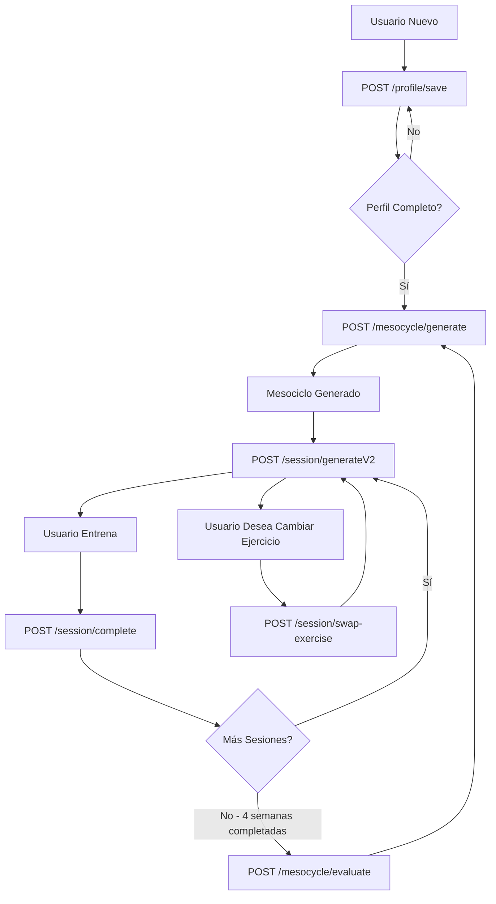

# 📘 Guía de Integración API - FitGen Backend

**Versión**: 2.0  
**Fecha**: Enero 2026  
**Destinatario**: Equipo de Desarrollo Frontend  
**Base URL**: `https://tu-dominio.vercel.app/api` o `http://localhost:3000/api`

---

## 📋 Tabla de Contenidos

1. [Autenticación](#autenticación)
2. [Flujo de Usuario Completo](#flujo-de-usuario-completo)
3. [Endpoints Detallados](#endpoints-detallados)
   - [POST /profile/save](#1-post-profilesave)
   - [POST /mesocycle/generate](#2-post-mesocyclegenerate)
   - [POST /session/generateV2](#3-post-sessiongeneratev2)
   - [POST /session/complete](#4-post-sessioncomplete)
   - [POST /session/swap-exercise](#5-post-sessionswap-exercise)
   - [POST /mesocycle/evaluate](#6-post-mesocycleevaluate)
   - [POST /profile/motivation](#7-post-profilemotivation)
4. [Modelos de Datos](#modelos-de-datos)
5. [Códigos de Error](#códigos-de-error)
6. [Mejores Prácticas](#mejores-prácticas)

---

## 🔐 Autenticación

**Todos los endpoints excepto `/profile/save`** requieren autenticación mediante Firebase ID Token.

### Headers Requeridos

```javascript
{
  "Content-Type": "application/json",
  "Authorization": "Bearer <FIREBASE_ID_TOKEN>"
}
```

### Obtención del Token

```javascript
// Ejemplo con Firebase Auth SDK
const user = firebase.auth().currentUser;
const idToken = await user.getIdToken();
```

### Manejo de Errores de Autenticación

| Código | Mensaje | Acción |
|--------|---------|--------|
| `401` | Token inválido/expirado | Refrescar token o re-autenticar |
| `401` | Token requerido | Incluir header Authorization |

---

## 🔄 Flujo de Usuario Completo



### Flujo Resumido

1. **Onboarding**: Usuario completa perfil → `POST /profile/save`
2. **Generación Plan**: Sistema genera mesociclo de 4 semanas → `POST /mesocycle/generate`
3. **Sesión Diaria**: 
   - Usuario abre app → `POST /session/generateV2` (genera sesión del día)
   - Usuario entrena y registra → `POST /session/complete`
4. **Finalización Ciclo**: Tras 4 semanas → `POST /mesocycle/evaluate`
5. **Nuevo Ciclo**: Sistema adapta y genera nuevo mesociclo → volver al paso 2

---

## 🎯 Endpoints Detallados

---

### 1. POST `/profile/save`

**Propósito**: Crear o actualizar perfil de usuario (onboarding o edición).

#### Request

**URL**: `/api/profile/save`

**Method**: `POST`

**Headers**:
```json
{
  "Content-Type": "application/json",
  "Authorization": "Bearer <FIREBASE_ID_TOKEN>" // OPCIONAL en desarrollo
}
```

**Body** (Onboarding Inicial):
```json
{
  "userId": "firebase_uid_aqui",
  "userEmail": "usuario@ejemplo.com",
  "action": "initial_onboarding_complete",
  "profileData": {
    "name": "Juan Pérez",
    "age": 30,
    "gender": "Masculino",
    "experienceLevel": "Intermedio",
    "fitnessGoal": "Hipertrofia",
    "trainingDaysPerWeek": 4,
    "sessionDuration": 60,
    "weeklyScheduleContext": [
      { "day": "Lunes", "canTrain": true, "externalLoad": "none" },
      { "day": "Martes", "canTrain": false, "externalLoad": "none" },
      { "day": "Miércoles", "canTrain": true, "externalLoad": "low" },
      { "day": "Jueves", "canTrain": false, "externalLoad": "none" },
      { "day": "Viernes", "canTrain": true, "externalLoad": "none" },
      { "day": "Sábado", "canTrain": true, "externalLoad": "moderate" },
      { "day": "Domingo", "canTrain": false, "externalLoad": "none" }
    ],
    "preferredTrainingLocation": "gym",
    "availableEquipment": [
      "Barra",
      "Mancuernas",
      "Banco",
      "Rack Sentadillas",
      "Maquina Cable",
      "Discos Peso"
    ],
    "injuriesOrLimitations": ["Hombro Derecho - Tendinitis"],
    "initialWeight": 75,
    "height": 175,
    "focusAreas": ["Pecho", "Espalda"]
  }
}
```

**Body** (Edición de Perfil Existente):
```json
{
  "userId": "firebase_uid_aqui",
  "userEmail": "usuario@ejemplo.com",
  "action": "profile_update_and_invalidate_plan",
  "profileData": {
    // Mismos campos que onboarding...
    "fitnessGoal": "Fuerza_Maxima" // Usuario cambió objetivo
  }
}
```

#### Campos Obligatorios en `profileData`

| Campo | Tipo | Valores Permitidos | Descripción |
|-------|------|-------------------|-------------|
| `name` | string | - | Nombre completo |
| `age` | number | 16-99 | Edad |
| `experienceLevel` | string | `"Principiante"`, `"Intermedio"`, `"Avanzado"` | Nivel de experiencia |
| `trainingDaysPerWeek` | number | 2-7 | Días de entrenamiento |
| `availableEquipment` | array | Ver tabla equipamiento | Lista de equipo disponible |
| `initialWeight` | number | 30-300 | Peso en kg |
| `fitnessGoal` | string | Ver tabla objetivos | Objetivo principal |
| `weeklyScheduleContext` | array | - | Contexto semanal (ver estructura) |

#### Valores de `fitnessGoal`

- `"Hipertrofia"` - Aumento de masa muscular
- `"Fuerza_Maxima"` - Aumento de fuerza pura
- `"Perdida_Grasa"` - Reducción de grasa corporal
- `"Resistencia"` - Mejora de capacidad aeróbica
- `"Rendimiento_Deportivo"` - Mejora atlética general

#### Estructura de `weeklyScheduleContext`

```json
{
  "day": "Lunes",           // Día de la semana
  "canTrain": true,         // ¿Puede entrenar este día?
  "externalLoad": "none"    // "none" | "low" | "moderate" | "high" | "extreme"
}
```

**externalLoad** representa fatiga externa (trabajo físico, deportes, etc.)

#### Equipo Disponible - Valores Válidos

**Gym Completo**:
```json
["Barra", "Mancuernas", "Banco", "Rack Sentadillas", "Maquina Cable", "Discos Peso", "Banco Inclinado", "Maquina Prensa"]
```

**Home Gym**:
```json
["Mancuernas (10kg)", "Mancuernas (15kg)", "Mancuernas (20kg)", "Barra (20kg)", "Banco Ajustable", "Discos Peso"]
```

**Bodyweight**:
```json
["Barra Dominadas", "Paralelas", "Peso Corporal"]
```

#### Response

**Success** (200):
```json
{
  "success": true,
  "message": "Perfil guardado exitosamente.",
  "userId": "firebase_uid_aqui"
}
```

**Error** (400):
```json
{
  "error": "Datos de perfil incompletos.",
  "details": "Faltan las claves: experienceLevel, fitnessGoal"
}
```

**Error** (401):
```json
{
  "error": "Faltan datos de usuario (userId) para continuar."
}
```

#### Diferencias entre Actions

| Action | Comportamiento | Cuándo usar |
|--------|---------------|-------------|
| `initial_onboarding_complete` | Crea `createdAt` | Primera vez que usuario completa perfil |
| `profile_update_and_invalidate_plan` | Elimina `currentMesocycle` y `currentSession` | Usuario edita perfil existente |

⚠️ **IMPORTANTE**: Si usas `profile_update_and_invalidate_plan`, debes llamar inmediatamente a `/mesocycle/generate` para crear nuevo plan.

---

### 2. POST `/mesocycle/generate`

**Propósito**: Generar plan de entrenamiento de 4 semanas basado en perfil del usuario.

#### Request

**URL**: `/api/mesocycle/generate`

**Method**: `POST`

**Headers**:
```json
{
  "Content-Type": "application/json",
  "Authorization": "Bearer <FIREBASE_ID_TOKEN>"
}
```

**Body**:
```json
{
  "firebaseUid": "firebase_uid_aqui"
}
```

⚠️ **NOTA**: El body puede estar vacío `{}` si el backend extrae el UID del token. El campo `firebaseUid` es opcional pero recomendado para claridad.

#### Response

**Success** (200):
```json
{
  "success": true,
  "message": "Mesociclo generado exitosamente",
  "mesocycle": {
    "mesocycleId": "meso_1234567890",
    "userId": "firebase_uid_aqui",
    "primaryGoal": "Hipertrofia",
    "experienceLevel": "Intermedio",
    "structureType": "Upper_Lower",
    "sessionsPerWeek": 4,
    "startDate": "2026-01-18T12:00:00.000Z",
    "endDate": "2026-02-15T12:00:00.000Z",
    "metadata": {
      "generatedAt": "2026-01-18T12:00:00.000Z",
      "version": "2.0",
      "goalReason": "Usuario eligió Hipertrofia como objetivo principal"
    },
    "week1": {
      "weekNumber": 1,
      "focus": "Exploración",
      "microcycle": {
        "intensityRpe": 7,
        "targetRIR": 2,
        "volumeMultiplier": 0.8
      },
      "sessions": [
        {
          "sessionId": "w1d1",
          "sessionFocus": "Upper",
          "dayIndex": 0,
          "weekNumber": 1
        },
        // ... más sesiones
      ]
    },
    "week2": { /* ... */ },
    "week3": { /* ... */ },
    "week4": { /* ... */ }
  }
}
```

**Error** (400):
```json
{
  "error": "Perfil incompleto. Complete su perfil antes de generar un mesociclo."
}
```

**Error** (401):
```json
{
  "error": "Token de autenticación requerido."
}
```

#### Campos Importantes del Mesociclo

| Campo | Descripción | Valores |
|-------|-------------|---------|
| `structureType` | Tipo de división muscular | `"Upper_Lower"`, `"Push_Pull_Legs"`, `"Full_Body"`, `"Bro_Split"` |
| `sessionsPerWeek` | Número de sesiones semanales | 2-7 |
| `weekX.microcycle.intensityRpe` | RPE objetivo de la semana | 6-9 |
| `weekX.sessions[].dayIndex` | Día de la semana (0=Lunes, 6=Domingo) | 0-6 |

#### Progresión Semanal Típica

- **Semana 1**: RPE 7, Volumen 80% - **Exploratoria** (pesos iniciales)
- **Semana 2**: RPE 7.5, Volumen 100% - **Acumulación**
- **Semana 3**: RPE 8, Volumen 110% - **Intensificación**
- **Semana 4**: RPE 6, Volumen 60% - **Deload** (recuperación)

---

### 3. POST `/session/generateV2`

**Propósito**: Generar sesión de entrenamiento específica para el día actual.

⚠️ **CRÍTICO**: Este endpoint obtiene **location** y **availableEquipment** del **perfil del usuario** en Firestore (`preferredTrainingLocation`, `availableEquipment`, `homeWeights`). **NO se deben enviar estos campos en el payload** para mantener consistencia en la sobrecarga progresiva.

#### Request

**URL**: `/api/session/generateV2`

**Method**: `POST`

**Headers**:
```json
{
  "Content-Type": "application/json",
  "Authorization": "Bearer <FIREBASE_ID_TOKEN>"
}
```

**Body Completo**:
```json
{
  "firebaseUid": "firebase_uid_aqui",
  "mesocycleId": "meso_1234567890",
  "weekNumber": 2,
  "dayIndex": 0,
  "painAreas": ["Hombro Derecho"],
  "readinessPreSession": 8,
  "sleepQuality": 7,
  "stressLevel": 3,
  "externalFatigue": "low",
  "availableTime": 60,
  "forceRegeneration": false
}
```

#### Campos Obligatorios

| Campo | Tipo | Descripción | Ejemplo |
|-------|------|-------------|---------|
| `firebaseUid` | string | UID de Firebase | `"abc123"` |
| `mesocycleId` | string | ID del mesociclo actual (del step 2) | `"meso_1234"` |
| `weekNumber` | number | Semana actual (1-4) | `2` |
| `dayIndex` | number | Índice del día (0=Lunes, 6=Domingo) | `0` |

#### Campos Opcionales (Autoregulación)

| Campo | Tipo | Rango | Default | Descripción |
|-------|------|-------|---------|-------------|
| `readinessPreSession` | number | 1-10 | 7 | Energía/preparación mental |
| `sleepQuality` | number | 1-10 | 7 | Calidad de sueño anoche |
| `stressLevel` | number | 1-10 | 5 | Nivel de estrés actual |
| `externalFatigue` | string | `"none"`, `"low"`, `"moderate"`, `"high"` | `"none"` | Fatiga de actividades externas |
| `availableTime` | number | 20-180 | 60 | Minutos disponibles |
| `painAreas` | array | - | `[]` | Áreas con dolor/molestia |
| `forceRegeneration` | boolean | - | `false` | Forzar regenerar sesión existente |

#### Ubicación y Equipamiento

⚠️ **CRÍTICO PARA SOBRECARGA PROGRESIVA**: El endpoint obtiene la ubicación de entrenamiento (`location`) y equipamiento disponible (`availableEquipment`) directamente del perfil del usuario en Firestore:

- **Campo en perfil**: `preferredTrainingLocation` → valores: `"gym"` o `"home"`
- **Campo en perfil**: `availableEquipment` → array de strings con equipo disponible
- **Campo en perfil** (opcional): `homeWeights` → objeto con pesos específicos para entrenamiento en casa

**¿Por qué se obtiene del perfil?**  
Esto garantiza que el sistema use siempre el mismo equipamiento para calcular progresiones semana a semana. Si el usuario pudiera cambiar el equipo en cada sesión, la sobrecarga progresiva se rompería (ej: hacer press banca con barra en S1 y con mancuernas en S2).

**Estructura de `homeWeights` en el perfil**:
```json
{
  "dumbbells": [5, 10, 15, 20],      // Array de pesos disponibles en kg
  "barbell": 20,                      // Peso de barra en kg
  "kettlebells": [8, 12, 16, 20]     // Array de kettlebells en kg
}
```

**Si el usuario necesita cambiar su equipamiento permanentemente**, debe editar su perfil usando `POST /profile/save` con `action: "profile_update_and_invalidate_plan"`, lo cual invalidará el mesociclo actual y generará uno nuevo.

#### Response

**Success** (200):
```json
{
  "success": true,
  "session": {
    "sessionId": "session_1234567890",
    "userId": "firebase_uid_aqui",
    "mesocycleId": "meso_1234567890",
    "weekNumber": 2,
    "dayIndex": 0,
    "sessionFocus": "Upper",
    "sessionGoal": "Hipertrofia",
    "structureType": "Upper_Lower",
    "generatedAt": "2026-01-18T12:00:00.000Z",
    "estimatedDuration": 65,
    
    "warmup": [
      {
        "id": "warmup_1",
        "nombre": "Movilidad Hombros",
        "descripcion": "Círculos amplios con brazos",
        "duracion": "2 min",
        "intensidad": "Baja"
      }
      // ... más ejercicios de calentamiento
    ],
    
    "mainBlock": [
      {
        "id": "press_banca_1",
        "nombre": "Press Banca",
        "descripcion": "Acostado en banco plano, baja barra hasta pecho y empuja hacia arriba",
        "equipo": ["Barra", "Banco", "Discos Peso"],
        "musculoPrimario": "Pecho",
        "musculosSecundarios": ["Tríceps", "Hombros"],
        "dificultad": "Intermedio",
        "prioridad": 1,
        
        "prescripcion": {
          "sets": 4,
          "repsObjetivo": 8,
          "pesoSugerido": 60,
          "rpeObjetivo": 7.5,
          "rirObjetivo": 2,
          "descansoEnSegundos": 120,
          "tempo": "3-1-2-1",
          "measureType": "reps",
          "explicacion": "Sobrecarga calculada: +2.5% según tu e1RM de 72.5kg."
        },
        
        "indicadores": {
          "pesoAnterior": "58.5kg",
          "repsAnterior": 8,
          "rirAnterior": "2.3",
          "e1RMEstimado": "72.5kg",
          "porcentajeObjetivo": "82%",
          "esMeseta": false
        },
        
        "correcciones": [
          "Mantén escápulas retraídas",
          "Pies firmes en el suelo",
          "No rebotes la barra en el pecho"
        ],
        
        "videoUrl": "https://ejemplo.com/press-banca",
        "gifUrl": "https://ejemplo.com/press-banca.gif"
      }
      // ... 4-7 ejercicios más
    ],
    
    "coreBlock": [
      {
        "id": "plank_1",
        "nombre": "Plancha",
        "tipo": "Anti-Extensión",
        "sets": 3,
        "duracion": "45s",
        "descanso": 60,
        "descripcion": "Mantén posición de plancha con core activado"
      }
      // ... 2-3 ejercicios core
    ],
    
    "cooldown": [
      {
        "id": "stretch_1",
        "nombre": "Estiramiento Pecho",
        "duracion": "30s",
        "descripcion": "En marco de puerta, brazo a 90°, gira torso"
      }
      // ... más estiramientos
    ],
    
    "educacion": {
      "conceptoDelDia": "Sobrecarga Progresiva",
      "explicacion": "Aumentar gradualmente el estímulo (peso, reps, o volumen) para forzar adaptación muscular. Hoy aumentamos el peso en 2.5% respecto a la sesión anterior.",
      "tipPractico": "Si no puedes completar las reps objetivo con el peso sugerido, reduce 5-10% y enfócate en la técnica perfecta."
    },
    
    "metadata": {
      "totalSeriesMainBlock": 20,
      "volumenTotal": 25,
      "intensidadPromedio": 7.5,
      "ajustesAutoregulacion": {
        "factorVolumen": 1.0,
        "multiplicadorDescanso": 1.0,
        "deltaRPE": 0,
        "deltaRIR": 0
      }
    }
  }
}
```

#### Campos Clave en `mainBlock[].prescripcion`

| Campo | Tipo | Descripción |
|-------|------|-------------|
| `sets` | number | Número de series a realizar |
| `repsObjetivo` | number/string | Reps objetivo (ej: `8` o `"8-10"`) |
| `pesoSugerido` | number/string | Peso en kg (`60`) o `"Exploratorio"` en Semana 1 |
| `rpeObjetivo` | number | RPE objetivo (6-10) |
| `rirObjetivo` | number | RIR objetivo (0-5) |
| `descansoEnSegundos` | number | Descanso entre series en segundos |
| `tempo` | string | Tempo de ejecución `"excéntrica-pausa-concéntrica-pausa"` |

#### Interpretación de Valores Especiales

**Peso "Exploratorio"** (Semana 1):
```json
{
  "pesoSugerido": "Exploratorio",
  "explicacion": "🔍 SEMANA 1 - Peso Exploratorio: Encuentra un peso que te permita completar 8 reps llegando a RIR 2 en la última serie."
}
```

**Tempo** `"3-1-2-1"`:
- `3` segundos excéntrica (bajar peso)
- `1` segundo pausa abajo
- `2` segundos concéntrica (subir peso)
- `1` segundo pausa arriba

**RPE y RIR**:
- RPE 7 = Moderado, podrías hacer 3 reps más
- RPE 8 = Difícil, podrías hacer 2 reps más (RIR 2)
- RPE 9 = Muy difícil, podrías hacer 1 rep más (RIR 1)
- RPE 10 = Máximo esfuerzo, 0 reps más (RIR 0)

#### Errores Comunes

**Error** (400) - Perfil sin ubicación:
```json
{
  "error": "El perfil del usuario no tiene una ubicación de entrenamiento válida (preferredTrainingLocation)",
  "code": "INVALID_PROFILE_LOCATION"
}
```

**Error** (400) - Perfil sin equipamiento:
```json
{
  "error": "El perfil del usuario no tiene equipamiento configurado (availableEquipment)",
  "code": "MISSING_PROFILE_EQUIPMENT"
}
```

**Error** (404):
```json
{
  "error": "No se encontró mesociclo activo para el usuario",
  "code": "NO_ACTIVE_MESOCYCLE"
}
```

**Error** (400):
```json
{
  "error": "Parámetros inválidos",
  "details": "weekNumber debe estar entre 1 y 4"
}
```

⚠️ **SOLUCIÓN**: Si el usuario ve estos errores, debe completar o actualizar su perfil usando `POST /profile/save` asegurándose de incluir `preferredTrainingLocation` y `availableEquipment`.

---

### 4. POST `/session/complete`

**Propósito**: Registrar feedback del usuario tras completar sesión. **CRÍTICO** para progresión automática.

#### Request

**URL**: `/api/session/complete`

**Method**: `POST`

**Headers**:
```json
{
  "Content-Type": "application/json",
  "Authorization": "Bearer <FIREBASE_ID_TOKEN>"
}
```

**Body**:
```json
{
  "firebaseUid": "firebase_uid_aqui",
  "sessionId": "session_1234567890",
  "performanceData": {
    "completedAt": "2026-01-18T14:30:00.000Z",
    "readinessPreSession": 8,
    "painAreas": ["Hombro Derecho"],
    "exercises": [
      {
        "exerciseId": "press_banca_1",
        "exerciseName": "Press Banca",
        "sets": [
          {
            "setNumber": 1,
            "reps": 8,
            "load": 60,
            "rir": 2.5,
            "rpe": 7.5,
            "completed": true
          },
          {
            "setNumber": 2,
            "reps": 8,
            "load": 60,
            "rir": 2,
            "rpe": 8,
            "completed": true
          },
          {
            "setNumber": 3,
            "reps": 7,
            "load": 60,
            "rir": 1.5,
            "rpe": 8.5,
            "completed": true
          },
          {
            "setNumber": 4,
            "reps": 7,
            "load": 60,
            "rir": 1,
            "rpe": 9,
            "completed": true
          }
        ]
      }
      // ... más ejercicios
    ]
  }
}
```

#### Campos Obligatorios

| Campo | Tipo | Descripción |
|-------|------|-------------|
| `firebaseUid` | string | UID de Firebase |
| `sessionId` | string | ID de la sesión (del response de generateV2) |
| `performanceData.completedAt` | string | Timestamp ISO 8601 |
| `performanceData.exercises` | array | Datos de rendimiento por ejercicio |

#### Estructura de `exercises[].sets[]`

| Campo | Tipo | Rango | Descripción |
|-------|------|-------|-------------|
| `setNumber` | number | 1-8 | Número de serie |
| `reps` | number | 1-30 | Reps completadas |
| `load` | number/null | 0-500 | Peso usado en kg (`null` para peso corporal) |
| `rir` | number | 0-5 | RIR percibido (Reps en Reserva) |
| `rpe` | number | 1-10 | RPE percibido (Esfuerzo Percibido) |
| `completed` | boolean | - | ¿Serie completada? |

⚠️ **IMPORTANTE**: 
- Para **peso corporal** (flexiones, dominadas): `load: null`
- Para **Semana 1 "Exploratorio"**: Usuario debe ingresar peso usado manualmente
- `rpe` y `rir` están relacionados: `rpe ≈ 10 - rir`

#### Response

**Success** (200):
```json
{
  "success": true,
  "message": "Sesión completada exitosamente",
  "stats": {
    "totalReps": 120,
    "totalVolume": 7200,
    "averageRPE": 8.2,
    "sessionDuration": 65
  },
  "progressionSummary": {
    "exercisesImproved": 4,
    "maintenanceExercises": 1,
    "nextSessionRecommendations": "Aumentar peso en Press Banca (+2.5kg)"
  }
}
```

**Error** (400):
```json
{
  "error": "Faltan datos requeridos (sessionFeedback, mainBlock)."
}
```

#### ¿Por qué es crítico este endpoint?

1. **Progresión Automática**: El backend usa estos datos para calcular pesos de la próxima sesión
2. **Detección de Mesetas**: Si el usuario no progresa en 3+ sesiones, el sistema ajusta automáticamente
3. **Autoregulación**: RIR/RPE reportados modifican intensidad de futuras sesiones
4. **Historial FIFO**: Se mantienen últimas 30 sesiones para análisis

---

### 5. POST `/session/swap-exercise`

**Propósito**: Cambiar un ejercicio específico por uno alternativo compatible.

#### Request

**URL**: `/api/session/swap-exercise`

**Method**: `POST`

**Headers**:
```json
{
  "Content-Type": "application/json",
  "Authorization": "Bearer <FIREBASE_ID_TOKEN>"
}
```

**Body**:
```json
{
  "blockType": "mainBlock",
  "blockIndex": 0,
  "exerciseIndex": 2,
  "targetId": "press_banca_1",
  "reason": "equipment_unavailable"
}
```

#### Campos Obligatorios

| Campo | Tipo | Descripción | Ejemplo |
|-------|------|-------------|---------|
| `blockType` | string | Tipo de bloque | `"mainBlock"`, `"coreBlock"`, `"warmup"` |
| `blockIndex` | number | Índice del bloque (si es array de bloques) | `0` |
| `exerciseIndex` | number | Índice del ejercicio dentro del bloque | `2` |
| `targetId` | string | ID del ejercicio a reemplazar | `"press_banca_1"` |

#### Valores de `reason`

- `"equipment_unavailable"` - Equipo no disponible
- `"discomfort"` - Ejercicio causa molestia
- `"preference"` - Usuario prefiere otro ejercicio
- `"difficulty"` - Ejercicio muy fácil/difícil

#### Response

**Success** (200):
```json
{
  "success": true,
  "message": "Ejercicio cambiado exitosamente",
  "newExercise": {
    "id": "press_mancuernas_1",
    "nombre": "Press Mancuernas",
    "descripcion": "Similar a press banca pero con mancuernas",
    "equipo": ["Mancuernas", "Banco"],
    "prescripcion": {
      "sets": 4,
      "repsObjetivo": 8,
      "pesoSugerido": 25,
      "rpeObjetivo": 7.5,
      "descansoEnSegundos": 120
    }
  },
  "updatedSession": {
    // Sesión completa actualizada con nuevo ejercicio
  }
}
```

**Error** (404):
```json
{
  "error": "No hay alternativas disponibles con tu equipo actual"
}
```

#### Lógica del Swap

El backend busca ejercicios alternativos que cumplan:
1. ✅ Mismo músculo primario
2. ✅ Misma categoría de movimiento (empuje horizontal/vertical, etc.)
3. ✅ Compatible con equipo disponible
4. ✅ Similar dificultad
5. ✅ No usado recientemente (últimas 7 sesiones)

---

### 6. POST `/mesocycle/evaluate`

**Propósito**: Evaluar mesociclo completado y preparar siguiente ciclo con ajustes.

⚠️ **Llamar solo al completar 4 semanas completas** (16 sesiones típicamente).

#### Request

**URL**: `/api/mesocycle/evaluate`

**Method**: `POST`

**Headers**:
```json
{
  "Content-Type": "application/json",
  "Authorization": "Bearer <FIREBASE_ID_TOKEN>"
}
```

**Body**:
```json
{
  "difficultyScore": 3,
  "likedMesocycle": true,
  "painAreas": ["Rodilla Izquierda"],
  "nextGoalPreference": "Fuerza_Maxima",
  "notes": "Muy bueno, pero semana 3 fue muy intensa"
}
```

#### Campos Obligatorios

| Campo | Tipo | Rango/Valores | Descripción |
|-------|------|--------------|-------------|
| `difficultyScore` | number | 1-5 | 1=Muy fácil, 5=Muy difícil |

#### Campos Opcionales

| Campo | Tipo | Descripción |
|-------|------|-------------|
| `likedMesocycle` | boolean | ¿Le gustó el ciclo? |
| `painAreas` | array | Áreas con dolor persistente |
| `nextGoalPreference` | string | Objetivo para siguiente ciclo |
| `notes` | string | Comentarios libres |

#### Escala de `difficultyScore`

- `1` → Muy fácil (siguiente ciclo: +10% volumen)
- `2` → Algo fácil (siguiente ciclo: +5% volumen)
- `3` → Adecuado (mantener intensidad)
- `4` → Algo difícil (reducir 5% volumen)
- `5` → Muy difícil (reducir 10% volumen)

#### Response

**Success** (200):
```json
{
  "success": true,
  "message": "Mesociclo evaluado exitosamente",
  "evaluation": {
    "completedAt": "2026-02-15T12:00:00.000Z",
    "mesocycleId": "meso_1234567890",
    "totalSessions": 16,
    "completedSessions": 15,
    "averageRPE": 7.8,
    "userDifficultyScore": 3,
    "analysis": {
      "action": "maintain",
      "factor": 1.0,
      "reason": "Intensidad adecuada.",
      "avgRpe": 7.8
    }
  },
  "nextCycleConfig": {
    "volumeAdjustment": 1.0,
    "intensityAdjustment": 1.0,
    "recommendedGoal": "Hipertrofia",
    "safetyProfile": {
      "avoidAxial": false,
      "avoidHighImpact": false,
      "loadCoef": 1.0
    }
  },
  "archivedMesocycle": {
    "id": "archive_2026-01-18",
    "originalMesocycle": { /* ... */ },
    "evaluation": { /* ... */ }
  }
}
```

#### Ajustes Automáticos para Siguiente Ciclo

| Condición | Ajuste de Volumen | Ajuste de Intensidad |
|-----------|------------------|---------------------|
| RPE promedio < 6 y difficultyScore = 1 | +15% | +5% |
| RPE promedio < 7 y difficultyScore = 2 | +5% | 0% |
| RPE promedio 7-8.5 y difficultyScore = 3 | 0% | 0% |
| RPE promedio > 9 y difficultyScore = 4-5 | -10% | -5% |

#### Perfil de Seguridad (Safety Profile)

Si `painAreas` incluye lesiones:
```json
{
  "safetyProfile": {
    "avoidAxial": true,        // Evitar sentadillas/peso muerto si hay dolor lumbar
    "avoidHighImpact": true,   // Evitar pliométricos si hay dolor articular
    "loadCoef": 0.9           // Reducir cargas 10%
  }
}
```

---

### 7. POST `/profile/motivation`

**Propósito**: Generar frase motivacional personalizada (opcional, mejora UX).

#### Request

**URL**: `/api/profile/motivation`

**Method**: `POST`

**Headers**:
```json
{
  "Content-Type": "application/json",
  "Authorization": "Bearer <FIREBASE_ID_TOKEN>"
}
```

**Body**:
```json
{
  "name": "Juan",
  "goal": "Hipertrofia"
}
```

#### Response

**Success** (200):
```json
{
  "success": true,
  "quote": "¡Hola Juan! Cada repetición te acerca a tu mejor versión. ¡Dale con todo!"
}
```

⚠️ **NOTA**: Este endpoint usa LLM (OpenRouter) cuando `IS_LLM_ACTIVE = true`. En desarrollo usa frases mock para evitar costos.

---

## 📦 Modelos de Datos

### Estructura de Usuario en Firestore

```json
{
  "userId": "firebase_uid",
  "email": "usuario@ejemplo.com",
  "plan": "free",
  "status": "approved",
  "createdAt": "2026-01-18T12:00:00.000Z",
  "lastProfileUpdate": "2026-01-18T12:00:00.000Z",
  
  "profileData": {
    "name": "Juan Pérez",
    "age": 30,
    "experienceLevel": "Intermedio",
    "fitnessGoal": "Hipertrofia",
    "trainingDaysPerWeek": 4,
    // ... todos los campos del perfil
  },
  
  "currentMesocycle": {
    // Objeto mesociclo completo
  },
  
  "currentSession": {
    // Sesión generada actual (si existe)
  },
  
  "recentSessions": [
    // Array FIFO de últimas 30 sesiones completadas
    {
      "sessionId": "session_123",
      "completedAt": "2026-01-18T14:30:00.000Z",
      "weekNumber": 2,
      "mainBlock": [ /* ... */ ]
    }
  ],
  
  "nextCycleConfig": {
    // Configuración para siguiente mesociclo (tras evaluación)
    "volumeAdjustment": 1.05,
    "safetyProfile": { /* ... */ }
  }
}
```

### Estructura de Sesión Completa

Ver response de `POST /session/generateV2` para estructura detallada.

**Bloques principales**:
- `warmup[]` - Calentamiento
- `mainBlock[]` - Bloque principal (4-7 ejercicios)
- `coreBlock[]` - Core (2-3 ejercicios)
- `cooldown[]` - Enfriamiento
- `educacion{}` - Contenido educativo
- `metadata{}` - Metadatos de la sesión

---

## ⚠️ Códigos de Error

### Errores de Autenticación (401)

| Mensaje | Causa | Solución |
|---------|-------|----------|
| `"Token de autenticación requerido"` | No se envió header Authorization | Incluir `Authorization: Bearer <token>` |
| `"Token inválido"` | Token malformado o incorrecto | Verificar formato del token |
| `"Token expirado"` | Token caducó (1 hora típicamente) | Refrescar token con Firebase SDK |

### Errores de Validación (400)

| Código | Mensaje | Causa |
|--------|---------|-------|
| `MISSING_USER_ID` | `"userId es requerido"` | No se envió userId |
| `INVALID_LOCATION` | `"location debe ser gym o home"` | Valor inválido en location |
| `MISSING_EQUIPMENT` | `"availableEquipment es requerido"` | No se envió array de equipo |
| `INVALID_WEEK` | `"weekNumber debe estar entre 1 y 4"` | weekNumber fuera de rango |

### Errores de Datos (404)

| Mensaje | Causa | Solución |
|---------|-------|----------|
| `"Usuario no encontrado"` | userId no existe en DB | Verificar que usuario completó onboarding |
| `"No se encontró mesociclo activo"` | Usuario sin plan generado | Llamar a `/mesocycle/generate` |
| `"Sesión no encontrada"` | sessionId inválido | Verificar ID de sesión |

### Errores del Servidor (500)

| Mensaje | Causa Probable | Acción |
|---------|---------------|---------|
| `"Error interno del servidor"` | Bug en backend o BD caída | Reportar a desarrollo |
| `"Error al generar mesociclo"` | Datos de perfil corruptos | Revisar profileData |

---

## 🎯 Mejores Prácticas

### 1. Gestión de Tokens

```javascript
// ✅ CORRECTO: Refrescar token antes de cada request crítico
async function apiCall(endpoint, data) {
  const user = firebase.auth().currentUser;
  const freshToken = await user.getIdToken(true); // Force refresh
  
  return fetch(endpoint, {
    method: 'POST',
    headers: {
      'Authorization': `Bearer ${freshToken}`,
      'Content-Type': 'application/json'
    },
    body: JSON.stringify(data)
  });
}
```

### 2. Manejo de Errores

```javascript
// ✅ CORRECTO: Manejo exhaustivo de errores
try {
  const response = await fetch('/api/session/generateV2', {
    method: 'POST',
    headers: { /* ... */ },
    body: JSON.stringify(payload)
  });
  
  const data = await response.json();
  
  if (!response.ok) {
    // Manejar errores específicos
    switch (data.code) {
      case 'NO_ACTIVE_MESOCYCLE':
        // Redirigir a generación de mesociclo
        router.push('/mesocycle/generate');
        break;
      case 'MISSING_EQUIPMENT':
        // Mostrar formulario de equipo
        showEquipmentModal();
        break;
      default:
        showError(data.error);
    }
    return;
  }
  
  // Procesar respuesta exitosa
  displaySession(data.session);
  
} catch (error) {
  // Error de red o parsing
  console.error('Network error:', error);
  showOfflineMessage();
}
```

### 3. Caché y Optimización

```javascript
// ✅ CORRECTO: Cachear mesociclo localmente
const mesocycle = localStorage.getItem('currentMesocycle');

if (!mesocycle || isMesocycleExpired(mesocycle)) {
  // Regenerar desde servidor
  const fresh = await fetchMesocycle();
  localStorage.setItem('currentMesocycle', JSON.stringify(fresh));
}
```

### 4. Validación de Datos Pre-Envío

```javascript
// ✅ CORRECTO: Validar antes de enviar
function validateSessionComplete(performanceData) {
  // Verificar que todas las series tengan RIR y RPE
  for (const exercise of performanceData.exercises) {
    for (const set of exercise.sets) {
      if (set.completed && (set.rir === undefined || set.rpe === undefined)) {
        throw new Error(`Falta RIR/RPE en ${exercise.exerciseName}, serie ${set.setNumber}`);
      }
    }
  }
  return true;
}
```

### 5. Progresión Semana a Semana

```javascript
// ✅ CORRECTO: Tracking de progreso
async function generateNextSession() {
  const currentWeek = getCurrentWeek(); // 1-4
  const dayIndex = getTodayIndex(); // 0-6
  
  // Obtener áreas con dolor del formulario pre-sesión
  const painAreas = await showPreSessionForm();
  
  const session = await fetch('/api/session/generateV2', {
    method: 'POST',
    headers: getAuthHeaders(),
    body: JSON.stringify({
      firebaseUid: user.uid,
      mesocycleId: getMesocycleId(),
      weekNumber: currentWeek,
      dayIndex,
      painAreas,
      // ... otros campos de readiness
    })
  });
  
  return session.json();
}
```

### 6. Semana 1 - Manejo Especial

```javascript
// ✅ CORRECTO: UI especial para pesos exploratorios
function renderExercisePrescription(exercise) {
  if (exercise.prescripcion.pesoSugerido === 'Exploratorio') {
    return (
      <div className="exploratory-weight">
        <Icon name="search" />
        <p>Peso Exploratorio</p>
        <input 
          type="number" 
          placeholder="Ingresa peso usado (kg)"
          onChange={(e) => setUserWeight(e.target.value)}
        />
        <HelpText>
          {exercise.prescripcion.explicacion}
        </HelpText>
      </div>
    );
  }
  
  // Peso específico para semanas 2-4
  return (
    <div className="prescribed-weight">
      <strong>{exercise.prescripcion.pesoSugerido} kg</strong>
      <ProgressIndicator 
        previous={exercise.indicadores.pesoAnterior}
        current={exercise.prescripcion.pesoSugerido}
      />
    </div>
  );
}
```

### 7. Feedback Visual de Progresión

```javascript
// ✅ CORRECTO: Mostrar progreso al usuario
function renderProgressIndicator(exercise) {
  const { pesoAnterior, e1RMEstimado } = exercise.indicadores;
  const pesoActual = exercise.prescripcion.pesoSugerido;
  
  const improvement = ((pesoActual - pesoAnterior) / pesoAnterior * 100).toFixed(1);
  
  if (improvement > 0) {
    return (
      <Badge color="green">
        <TrendingUp /> +{improvement}%
      </Badge>
    );
  } else if (improvement === 0) {
    return <Badge color="blue">Mantenimiento</Badge>;
  } else {
    return (
      <Badge color="amber">
        <Info /> Deload
      </Badge>
    );
  }
}
```

---

## 🔄 Flujo Completo - Ejemplo de Integración

```javascript
// PASO 1: Onboarding
async function completeOnboarding(formData) {
  const response = await fetch('/api/profile/save', {
    method: 'POST',
    headers: {
      'Content-Type': 'application/json'
    },
    body: JSON.stringify({
      userId: user.uid,
      userEmail: user.email,
      action: 'initial_onboarding_complete',
      profileData: {
        name: formData.name,
        age: formData.age,
        experienceLevel: formData.experience,
        fitnessGoal: formData.goal,
        trainingDaysPerWeek: formData.daysPerWeek,
        weeklyScheduleContext: formData.schedule,
        preferredTrainingLocation: formData.location,
        availableEquipment: formData.equipment,
        // ... más campos
      }
    })
  });
  
  const data = await response.json();
  if (data.success) {
    // Ir a generación de mesociclo
    return generateMesocycle();
  }
}

// PASO 2: Generar Mesociclo
async function generateMesocycle() {
  const token = await user.getIdToken();
  
  const response = await fetch('/api/mesocycle/generate', {
    method: 'POST',
    headers: {
      'Authorization': `Bearer ${token}`,
      'Content-Type': 'application/json'
    },
    body: JSON.stringify({ firebaseUid: user.uid })
  });
  
  const data = await response.json();
  if (data.success) {
    // Guardar mesociclo localmente
    localStorage.setItem('mesocycle', JSON.stringify(data.mesocycle));
    // Ir a dashboard
    router.push('/dashboard');
  }
}

// PASO 3: Generar Sesión del Día
async function generateTodaySession() {
  const mesocycle = JSON.parse(localStorage.getItem('mesocycle'));
  const currentWeek = calculateCurrentWeek(mesocycle.startDate);
  const dayIndex = new Date().getDay(); // 0-6
  
  // Mostrar formulario pre-sesión (solo para readiness/autoregulación)
  const readinessData = await showPreSessionModal();
  
  const token = await user.getIdToken();
  const response = await fetch('/api/session/generateV2', {
    method: 'POST',
    headers: {
      'Authorization': `Bearer ${token}`,
      'Content-Type': 'application/json'
    },
    body: JSON.stringify({
      firebaseUid: user.uid,
      mesocycleId: mesocycle.mesocycleId,
      weekNumber: currentWeek,
      dayIndex,
      readinessPreSession: readinessData.energy,
      sleepQuality: readinessData.sleep,
      stressLevel: readinessData.stress,
      externalFatigue: readinessData.externalFatigue,
      painAreas: readinessData.painAreas,
      availableTime: readinessData.timeAvailable
      // NOTA: NO se envía location ni availableEquipment
      // El backend los obtiene del perfil del usuario
    })
  });
  
  const data = await response.json();
  if (data.success) {
    // Mostrar sesión al usuario
    displaySessionUI(data.session);
  }
}

// PASO 4: Completar Sesión
async function completeSession(sessionId, performanceData) {
  const token = await user.getIdToken();
  
  const response = await fetch('/api/session/complete', {
    method: 'POST',
    headers: {
      'Authorization': `Bearer ${token}`,
      'Content-Type': 'application/json'
    },
    body: JSON.stringify({
      firebaseUid: user.uid,
      sessionId,
      performanceData: {
        completedAt: new Date().toISOString(),
        readinessPreSession: performanceData.preEnergy,
        painAreas: performanceData.painAreas,
        exercises: performanceData.exercises // Array con sets completados
      }
    })
  });
  
  const data = await response.json();
  if (data.success) {
    // Mostrar resumen y progreso
    showSessionSummary(data.stats, data.progressionSummary);
  }
}

// PASO 5: Evaluar Mesociclo (tras 4 semanas)
async function evaluateMesocycle() {
  const token = await user.getIdToken();
  
  const feedback = await showEvaluationModal();
  
  const response = await fetch('/api/mesocycle/evaluate', {
    method: 'POST',
    headers: {
      'Authorization': `Bearer ${token}`,
      'Content-Type': 'application/json'
    },
    body: JSON.stringify({
      difficultyScore: feedback.difficulty, // 1-5
      likedMesocycle: feedback.liked,
      painAreas: feedback.persistentPain,
      nextGoalPreference: feedback.nextGoal,
      notes: feedback.comments
    })
  });
  
  const data = await response.json();
  if (data.success) {
    // Mostrar resultados y generar nuevo ciclo
    showEvaluationResults(data.evaluation);
    return generateMesocycle(); // Nuevo ciclo
  }
}
```

---

## 📞 Soporte y Contacto

Para dudas técnicas o problemas de integración:

- **Documentación Adicional**: Ver [`/docs/FRONTEND_COMPLETE_PAYLOAD.md`](./FRONTEND_COMPLETE_PAYLOAD.md)
- **Especificaciones Técnicas**: Ver [`/docs/API_SESSION_GENERATEV2_SPEC.md`](./API_SESSION_GENERATEV2_SPEC.md)
- **GitHub Issues**: [Reportar bugs]
- **Email Desarrollo**: desarrollo@fitgen.com

---

## 🔄 Control de Versiones

| Versión | Fecha | Cambios |
|---------|-------|---------|
| 2.0 | Enero 2026 | Documentación completa inicial |

---

**Última Actualización**: 19 de Enero, 2026  
**Mantenido por**: Equipo Backend FitGen
